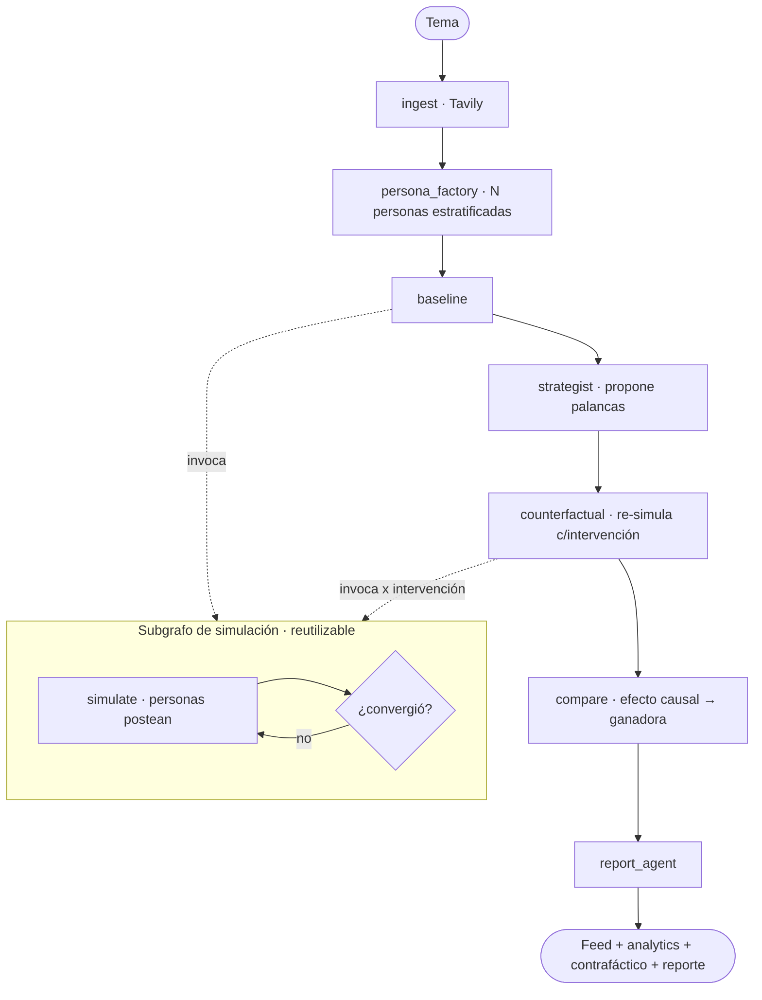

# ÁGORA — Simulación multi-agente de dinámica de opinión

POC de un **flujo agentic multi-agente** construido con **LangGraph**. Un enjambre de
agentes con perfiles distintos (*personas*) debate un tema durante varias rondas
(*baseline*); luego un agente **Estratega** propone intervenciones y el sistema
**re-simula** cada una para descubrir **qué palanca mejora la recepción** — un loop
contrafáctico que convierte el simulador en una herramienta de decisión.

Es una aplicación de **agent-based social simulation** con agentes LLM, fundada en:
- **Generative Agents** (Park et al., 2023, *Interactive Simulacra of Human Behavior*) — agentes LLM que simulan comportamiento humano.
- **Hegselmann–Krause** (2002, *Opinion Dynamics and Bounded Confidence*) — el modelo de convergencia/polarización de opiniones que nuestro loop implementa de forma simplificada.

El aporte propio sobre esa base es el **loop contrafáctico de intervención**
(*simular → proponer palanca → re-simular → medir efecto causal → recomendar*).

> **Caso de uso (product marketing):** antes de lanzar un cambio de producto, un precio o un
> mensaje, simulá cómo reacciona el público y descubrí qué framing reduce la fricción. Un
> pre-mortem barato (minutos y centavos) para detectar objeciones y priorizar qué testear
> después con investigación real.

## ¿Qué demuestra?

| Requisito del challenge | Cómo se cumple |
|---|---|
| Framework de orquestación | **LangGraph** (grafo padre + **subgrafo** de simulación con conditional edges + ciclo) |
| 2+ agentes con roles diferenciados | `persona_factory`, N *personas*, `strategist`, `report_agent` |
| Comunicación entre agentes | **Estado compartido** (`feed`): cada persona lee el feed acumulado y responde |
| Toma de decisiones | **(1)** convergencia (conditional edge del subgrafo) · **(2)** palanca ganadora (`compare`) |
| Herramienta / fuente externa | **Tavily** (búsqueda web) para anclar el debate en contexto real |
| Logging / trazabilidad | Cada nodo narra el intercambio en consola |
| Diagrama de arquitectura | Mermaid (abajo) + autogenerado por LangGraph |

## Arquitectura



**El diálogo entre agentes** ocurre vía el estado compartido `feed`. Las personas
reaccionan **secuencialmente** dentro de cada ronda, así cada una ve lo que postearon
las anteriores y puede responderles por nombre — de ahí emerge la conversación
(contagio de opinión, formación de bandos).

### Mecánicas clave

- **Estratificación por arquetipo:** las personas no se generan al azar. Cada una se
  asigna a un arquetipo (entusiasta, escéptico, experto, indeciso/swing, afectado,
  observador) con **distribuciones controladas** de `stance`, `volatility`, `influence`
  y `activity`. Garantiza un panel diverso y con tensión.
- **Participación no-uniforme:** todos opinan en la ronda 1; desde la 2, cada persona
  postea con probabilidad = su `activity`.
- **Sentimiento ponderado por influencia:** la voz del experto pesa más al medir el
  "humor" colectivo y la convergencia (en línea con los modelos de opinion dynamics).
- **Analytics pre-computados** (`src/analytics.py`): facciones, ranking de influencia,
  trayectoria y polarización — se le pasan al `report_agent` como evidencia dura.
- **Loop contrafáctico:** el Estratega propone intervenciones; cada una se re-simula
  partiendo de la opinión final del baseline; `compare` mide el efecto causal (Δ del
  sentimiento, a quién convence) y elige la ganadora.
- **Prompt "vista de Dios":** el reporte se redacta como predicción de comportamiento
  futuro, anclado **solo** en los datos de la simulación (anti-alucinación).

## Stack

LangGraph · Google Gemini 2.5 Flash (`langchain-google-genai`) · Tavily
(`langchain-tavily`) · Streamlit · Pydantic.

## Requisitos

- Python 3.13+
- [`uv`](https://docs.astral.sh/uv/)

## Instalación y configuración

```bash
uv sync
```

Creá un `.env` (basado en `.env.example`):

```env
GOOGLE_API_KEY=tu_api_key_de_google   # obligatoria
TAVILY_API_KEY=tu_api_key_de_tavily   # opcional; sin ella corre sin contexto externo
```

## Cómo correr

```bash
uv run streamlit run app.py                          # UI
uv run python main.py "tu tema acá"                  # CLI / headless
uv run python tests/test_offline.py                  # test de orquestación (sin API)
```

Ver [sample_run.md](sample_run.md) para una corrida real completa.

## Trazabilidad (ejemplo de consola)

```
[persona_factory] 6 personas generadas → Sofía(+0.8/inf1.0) · Ramiro(-0.8/inf1.0) · ...
[baseline] simulación del status quo
[base r1] postean 6/6 personas
  ↳ [base r1] Ramiro 🔴-0.80: @Sofía, centralizar documentos es una puerta abierta a ciberataques...
[base r1] sentimiento ponderado +0.03 | Δ=n/a (1ra ronda)
[strategist] 2 intervenciones propuestas → Verificación descentralizada | Auditoría independiente
[counterfactual] re-simulando con: «Verificación descentralizada»
[compare] ganadora → Verificación descentralizada
[report_agent] reporte final generado.
```

### Observabilidad

- **Logging estructurado** por nodo (arriba): el intercambio entre agentes se lee como diálogo.
- **Contador de llamadas LLM** (`src/metrics.py`): un callback contabiliza *todas* las
  invocaciones a Gemini en la corrida (parent + subgrafo) desde un único punto de enganche;
  se reporta al final ("N llamadas a Gemini").
- **LangSmith** (opcional): seteá `LANGSMITH_TRACING=true` y `LANGSMITH_API_KEY` en el `.env`
  y LangGraph traza automáticamente cada nodo, prompt y latencia (timeline completo).

### Eficiencia / costo (decisión consciente)

El loop contrafáctico multiplica las llamadas (1 baseline + K intervenciones). Es un trade
deliberado **profundidad analítica > costo**, mitigado por:
- **Convergencia temprana**: la simulación corta apenas el sentimiento se estabiliza (no gasta
  rondas de más).
- **Participación no-uniforme**: en rondas avanzadas postean menos personas → menos llamadas.
- **Configurable**: `NUM_PERSONAS`, `MAX_ROUNDS` y `NUM_INTERVENTIONS` en `src/config.py`.

## Validación de utilidad

No alcanza con que corra: medimos si **sirve** y si **le pega a la realidad**
(`validation/`, resultados completos en [validation/RESULTS.md](validation/RESULTS.md)):

| Test | Resultado | Qué prueba |
|---|---|---|
|  Placebo | ✅ PASS | La recomendación es significativa (real Δ+0.19 vs placebo ≈0), no ruido. |
|  Test-retest | ✅ PASS | Estable: la ganadora no cambia entre corridas (3/3); baseline ±0.05. |
| Validez externa | ✅ 60% vs azar 50% | Predice el ganador de A/B **reales** (Upworthy clicks); 67% en casos claros. |

ÁGORA es una herramienta de **pre-mortem / priorización de mensajes** (cf. Argyle et al.
2023): su fortaleza está en el ordenamiento relativo de intervenciones y las objeciones que
surgen, validado contra comportamiento real (clicks). Un primer filtro rápido y barato que
complementa la investigación tradicional.

```bash
uv run python validation/placebo_test.py
uv run python validation/reliability_test.py
uv run python validation/ab_validation.py     # requiere el CSV de Upworthy (ver validation/README.md)
```

## Estructura del proyecto

```
.
├── app.py                # UI Streamlit
├── main.py               # CLI headless
├── src/
│   ├── agent.py          # grafo PADRE (baseline → estratega → contrafáctico → compare → report)
│   ├── simulation.py     # SUBGRAFO de simulación (loop de convergencia) + run_simulation()
│   ├── nodes.py          # nodos del grafo padre
│   ├── analytics.py      # facciones, influencia, trayectoria, comparación contrafáctica
│   ├── schema.py         # estados (SimState, AgentState) + modelos Persona/Post
│   ├── config.py         # parámetros + arquetipos con distribuciones
│   └── utils.py          # prompts, parsers JSON, logging
└── tests/
    └── test_offline.py   # test end-to-end mockeado (valida toda la orquestación)
```

Ver [SUBMISSION_NOTES.md](SUBMISSION_NOTES.md) para decisiones de diseño y trade-offs.

## Referencias

- Park, J. S., O'Brien, J., Cai, C. J., Morris, M. R., Liang, P., & Bernstein, M. S. (2023). *Generative Agents: Interactive Simulacra of Human Behavior.* UIST '23. arXiv:2304.03442.
- Hegselmann, R., & Krause, U. (2002). *Opinion Dynamics and Bounded Confidence Models, Analysis, and Simulation.* JASSS 5(3).
