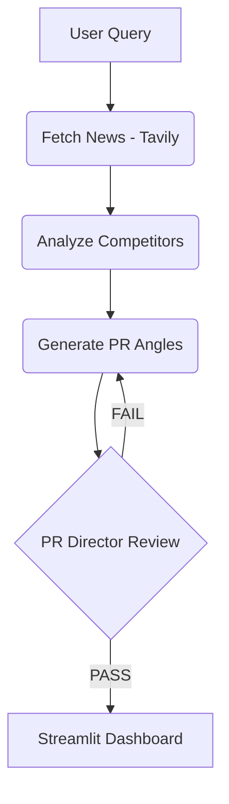

# Volta AI Story Angle Generator - Submission Overview

## Overview
This project is a functional prototype designed for the Volta PR team. It automates the transition from raw industry news to high-level, strategic PR story angles. Unlike a simple LLM prompt, this tool implements an **Agentic Workflow** that simulates a professional PR editorial process.

## Technical Approach

### 1. Orchestration: LangGraph (Evaluator-Optimizer Pattern)
Instead of a single-shot generation, I implemented an **Iterative Loop** using LangGraph. 
- **The Strategist (Generator):** Creates initial story angles based on real-time news and competitor data.
- **The PR Director (Evaluator):** A specialized critic node that reviews the output against strict criteria (Freshness, Competitor Contrast, and Core Strategy).
- **The Optimization Loop:** If the "Director" rejects the angles, the agent automatically iterates, feeding the feedback back to the generator to fix specific issues.

### 2. Data Retrieval: Tavily AI Search
I utilized **Tavily** for real-time news retrieval. 
- **Freshness Control:** The system calculates a dynamic date range (last 2-4 weeks) and uses date-filtering queries (`after:YYYY-MM-DD`) to ensure every story angle is grounded in current events, avoiding stale data.

### 3. LLM: Google Gemini 2.5 Flash
Chosen for its high-speed processing and excellent performance in structured data extraction (JSON), ensuring the output is always ready for programmatic display.

## Key Features & PR Logic

- **Competitor Contrast:** The agent automatically scans news for mentions of **ChargePoint, EVgo, and Blink**. It then generates angles that explicitly contrast Volta’s specific value proposition (community/retail charging) against these competitors.
- **Strategic Categorization:** Each angle is mapped to a specific media type (Trade, Business, Consumer, or Local) according to the project brief requirements.
- **Automated Research Rationale:** Every angle includes a "Why Now" section and links to the original source, providing the PR team with immediate "proof points" for their pitch.

## System Architecture



## How to Run
1. Ensure API keys (`GOOGLE_API_KEY`, `TAVILY_API_KEY`) are in the `.env` file.
2. Run the application using:
   ```bash
   uv run streamlit run app.py
   ```

## Design Philosophy
My goal was to build a tool that understands the **business of PR**, not just a tool that summarizes text. By separating the logic into discrete nodes (Search, Analysis, Generation, and Review), the system demonstrates better judgment and delivers outputs that are "pitch-ready" for high-tier publications like Bloomberg or TechCrunch.
